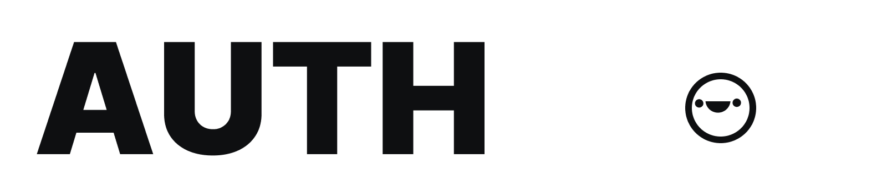

  <picture>
    <source media="(prefers-color-scheme: dark)" srcset="./logo2.png">
    
  </picture>
  </a>

 
 

  
  
  

<h1 align="center">The open-source auth platform for developers</h1>

The ultimate service for managing auth platform with a single API.

<h4 align="center">
  built with passion by<b> <a href="https://dotted-labs.dev">dotted-labs.dev</a></b> 
</h4>
